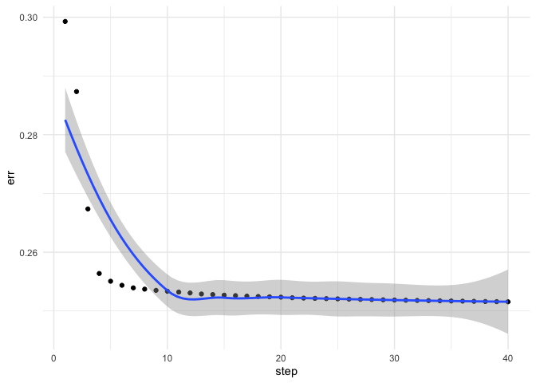

bnnlib
======

`bnnlib` is a library for neural networks written covering (deep)
recurrent networks with long-short-term-memory (LSTM) cells. The library
is written in C++ and offers R-bindings via a SWIG interface.

The original code was written in 2008 and lied dormant for more than 10
years.

Setup
=====

    dyn.load(paste("bnnlib", .Platform$dynlib.ext, sep=""))
    source("bnnlib.R")
    cacheMetaData(1)

Usage
=====

Create a Neural network
-----------------------

`bnnlib` has some factory functions to easily create standard
architectures of neural networks. This is a single hidden layer network
with LSTM cells (Schmidhuber & Hochreiter, 1997). The function takes
three arguments, the number of inputs nodes, the number of LSTM cells,
and the number of output nodes. The following network has a single input
node, two LSTM cells, and one output node:

    net <- LSTMNetwork(1,2,1)

Creating Training Data
----------------------

    seq <- SequenceSet()
    delay <- 10

    num.seq <- 5

    for (i in 1:num.seq) {
    len <- 50
    # create a sequence from scratch
    input <- rep(0,len)
    output <- rep(0,len)

    pos <- runif(1,1,40)
    cat(i,".: Position=",pos,"\n")
    input[pos]<-1
    output[pos+delay]<-1

    seq1<-Sequence(input,output,len)

    SequenceSet_add_sequence(seq,seq1)

    }

    ## 1 .: Position= 11.82975 
    ## 2 .: Position= 33.43796 
    ## 3 .: Position= 1.964937 
    ## 4 .: Position= 12.00704 
    ## 5 .: Position= 6.60916

Creating a Trainer
------------------

There are different training algorithms available that mostly are
different flavors of back-propagation.

    bp <- ImprovedRPropTrainer(net)

Start the Training
------------------

    iterations <- 40
    steps.per.iteration <- 400
    err <- rep(NA, iterations)
    for (i in 1:iterations) {
      cat("Training the network for ", steps.per.iteration," steps\n")
      Trainer_train__SWIG_0(bp, seq, steps.per.iteration)
      err[i] <- Network_evaluate_training_error__SWIG_0(net, seq)
    }

    ## Training the network for  400  steps
    ## Training the network for  400  steps
    ## Training the network for  400  steps
    ## Training the network for  400  steps
    ## Training the network for  400  steps
    ## Training the network for  400  steps
    ## Training the network for  400  steps
    ## Training the network for  400  steps
    ## Training the network for  400  steps
    ## Training the network for  400  steps
    ## Training the network for  400  steps
    ## Training the network for  400  steps
    ## Training the network for  400  steps
    ## Training the network for  400  steps
    ## Training the network for  400  steps
    ## Training the network for  400  steps
    ## Training the network for  400  steps
    ## Training the network for  400  steps
    ## Training the network for  400  steps
    ## Training the network for  400  steps
    ## Training the network for  400  steps
    ## Training the network for  400  steps
    ## Training the network for  400  steps
    ## Training the network for  400  steps
    ## Training the network for  400  steps
    ## Training the network for  400  steps
    ## Training the network for  400  steps
    ## Training the network for  400  steps
    ## Training the network for  400  steps
    ## Training the network for  400  steps
    ## Training the network for  400  steps
    ## Training the network for  400  steps
    ## Training the network for  400  steps
    ## Training the network for  400  steps
    ## Training the network for  400  steps
    ## Training the network for  400  steps
    ## Training the network for  400  steps
    ## Training the network for  400  steps
    ## Training the network for  400  steps
    ## Training the network for  400  steps

With ggplot2, we can plot the training set error over iterations:

    require(ggplot2)

    ## Loading required package: ggplot2

    ggplot(data=data.frame(step=1:iterations,err),aes(x=step,y=err))+
      geom_point()+
      geom_smooth()+
      theme_minimal()

    ## `geom_smooth()` using method = 'loess' and formula 'y ~ x'

